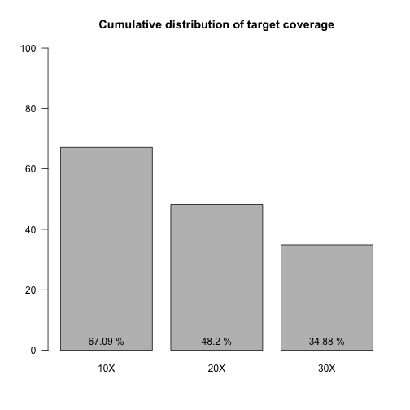
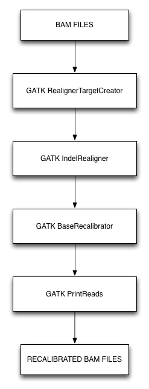
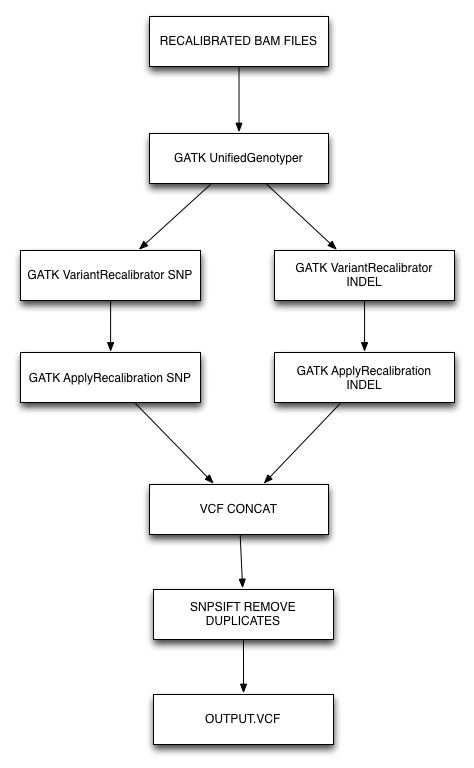
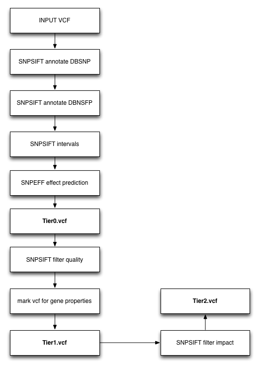

Report for WES Resequencing Project: Borghini_113_CAPS
==========================================

*Analysis by Davide Rambaldi*

---

### Table of Contents

* [Project Overview](#overview)
* [Experimental design](#design)
 * [Pedigrees](#pedigrees)
 * [Samples info](#samples_info)
* [Library preparation](#library_preparation)
* [Sequencing](#sequencing)
 * [Sequence Alignment Methodology](#seq_methods)
 * [Quality Assessment of Sequencing](#seq_quality)
* [Variants calling](#variant_calling)
 * [Variants calling methodology](#variant_methodology)
  * [Filters](#variant_filters)
  * [Additional datasets](#additional_datasets)
 * [Variants calling results](#variant_results)
 * [Variant Annotation and Selection Methodology](#variant_annotations)
 * [Variant Annotation and Selection Results](#variant_annotation_results)
* [Genes prioritization](#genes_prioritization)
 * [Genes prioritization methodology](#genes_prioritization_methods)
 * [Genes prioritization results](#genes_prioritization_results)

---

#  OVERVIEW

### Ricerca di nuovi geni coinvolti nel gruppo eterogeneo di malattie autoinfiammatorie con fenotipo simile a CAPS (Cryopyrin associated periodic syndromes ) 

Le CAPS sono malattie autoinfiammatorie rare, autosomiche dominanti, associate all'attivazione 
della risposta infiammatoria in apparente assenza di eventi infettivi. Circa il 70% dei pazienti ha 
una mutazione de novo nel gene NLRP3, in piccolo percentuale dovuta a mosaicismo non 
rilevabile con il metodo Sanger.

Grazie alla collaborazione con clinici distribuiti lungo tutto il territorio nazionale, si stanno 
raccogliendo PBMCs di pazienti con fenotipo CAPS ma senza mutazione individuabile al gene 
NLRP3 e dei genitori disposti a partecipare allo studio. Si dispone  della sequenza 
dell'Esoma di due pazienti per i quali era stata esclusa la presenza di mosaicismo a NLRP3. 

#### BACKGROUND

Le CAPS sono rare condizioni monogeniche appartenenti alle malattie autoinfiammatorie (AIDS), 
la cui caratteristica clinica comune è l'attivazione della risposta infiammatoria in apparente
assenza di eventi infettivi. 
Esse sono dovute a mutazioni di geni codificanti proteine che svolgono un ruolo fondamentale 
nella regolazione della risposta infiammatoria, spiegando così il fenotipo associato.
Anche se le manifestazioni cliniche delle AIDs sono spesso sovrapponibili, le CAPS sono 
caratterizzate in particolare da orticaria cutanea atipica cronica o ricorrente, associata 
inoltre a diversi sintomi sistemici.
Pertanto, diversamente da altre AIDS, le CAPS presentano un fenotipo generalmente specifico, 
benchè questo non corrisponda ad omogeneia' di difetti genetici. 
Circa il 70% dei pazienti affetti da CAPS hanno una mutazione nel gene NLRP3, 
una piccola percentuale delle quali in stato di mosaico. 
Inoltre, ad oggi, le mutazioni del gene NLRP12 sono state identificate in soli sei diversi 
pazienti caratterizzati da un fenotipo specifico: la sensibilita' al freddo. 
Gli individui affetti rimanenti non hanno una diagnosi genetica e sono quindi indicati come CAPS-like. 
L'identificazione di altri geni è auspicabile non solo per fornire una corretta diagnosi genetica ai
pazienti e per valutare il rischio di ricorrenza, ma anche per identificare nuovi bersagli molecolari 
per approcci terapeutici alternativi agli antagonisti attualmente utilizzati, tra cui quello per l'IL1beta (anakinra) 
che sono costosi, hanno bisogno di iniezioni sottocutanee settimanali e 
hanno recentemente mostrato fenomeni di resistenza. 

#### Experimental design

I pazienti con un fenotipo clinico e immunologico tipico delle CAPS sono sottoposti regolarmente nel nostro laboratorio da ormai dieci anni 
allo screening di mutazione per l'esone 3 di NLRP3 e, in caso di sensibilita' al freddo, dell'esone 3 di NLRP12. 
Per perseguire l'obiettivo di identificare nuovi geni responsabili dello sviluppo di CAPS, abbiamo selezionato i pazienti risultati 
negativi per lo screening della sequenza codificante totale dei due geni NLRP, anche per la condizione di mosaico nel caso del gene 
NLRP3 (analisi eseguita mediante tecniche di next generation sequencing con copertura 1000X). 
DNA da pazienti senza mutazione saranno sottoposti a sequenziamento dell'intero esoma (WES) al fine di identificare mutazioni in geni nuovi. 
L'analisi WES sara' condotta anche sul DNA di quei genitori che accettano di partecipare allo studio. 
In questo caso l'analisi statistica sara' basata sulla ricerca di una mutazione de novo, aumentando così il potere dello studio.
I geni candidati promettenti saranno convalidati con il metodo Sanger. 
Gli studi funzionali saranno opportunamente impostati per ogni nuovo gene, sulla base del suo ruolo specifico cellulare, e condotti in cellule di pazienti e / o in linee cellulari.

#### REFERENCES

* Ng, S. B., Bigham, A. W., Buckingham, K. J., Hannibal, M. C., McMillin, M. J.,Gildersleeve, H. I., Beck, A. E., Tabor, H. K., Cooper, G. M., Mefford, H. C.,Lee, C., Turner, E. H., and 9 others. Exome sequencing identifies MLL2 mutations as a cause of Kabuki syndrome. Nature Genet. 42: 790-793, 2010. [PubMed: 20711175]
* Hoffman H et al. (2001). Nat Genet 29:301-5
* Feldmann J et al. (2002). Am J Hum Genet 71:198-203
* Touitou I et al. (2004) Hum Mutat 24:194-8
* Ye Z & Ting J (2008) Curr Opin Immunol 20:3-9
* Borghini S et al. (2010) Arthritis Rheum. 63:830-9
* Izawa et al. (2012) Dna research 19: 143-152

---

#  Sequencing Experimental Design

###  Pedigrees, Frequency and Variant Selection Model

  

The frequency of the disease in the population is __0.05__.
Model used for interesting variant selection: __recessive model__.

###  Samples info

We received a total of __50__ samples and we sequenced __20__ samples.

<!-- html table generated in R 3.1.0 by xtable 1.7-3 package -->
<!-- Wed Jul 23 14:47:54 2014 -->
<TABLE border=1>
<TR> <TH> SampleName </TH> <TH> SampleInfo (design) </TH>  </TR>
  <TR> <TD align="center"> 5A </TD> <TD align="center"> Proband </TD> </TR>
  <TR> <TD align="center"> 5P </TD> <TD align="center"> Father </TD> </TR>
  <TR> <TD align="center"> 5M </TD> <TD align="center"> Mother </TD> </TR>
  <TR> <TD align="center"> 8A </TD> <TD align="center"> Proband </TD> </TR>
  <TR> <TD align="center"> 8P </TD> <TD align="center"> Father </TD> </TR>
  <TR> <TD align="center"> 8M </TD> <TD align="center"> Mother </TD> </TR>
  <TR> <TD align="center"> 9A </TD> <TD align="center"> Proband </TD> </TR>
  <TR> <TD align="center"> 9P </TD> <TD align="center"> Father </TD> </TR>
  <TR> <TD align="center"> 9M </TD> <TD align="center"> Mother </TD> </TR>
  <TR> <TD align="center"> 9S </TD> <TD align="center"> Sister </TD> </TR>
  <TR> <TD align="center"> 9F </TD> <TD align="center"> Son </TD> </TR>
  <TR> <TD align="center"> 10A </TD> <TD align="center"> Proband </TD> </TR>
   </TABLE>

#  Library preparation

We used Exome sequencing with Illumina  __HiSeq 2500__ (view service chart), using the __Nextera__ protocol.

Kit name: __1.3__.

All libraries were tested for quality wth BioAnalyzer (Agilent) and QUBIT (Life Technologies) and passed the QC steps.

#  Sequencing

###  Sequence Alignment Methodology

The alignments were processed using the procedure described be 1000g consortium (Gil A McVean et al., Nature 2012) including the variant call.
We __aligned__ the reads got from the Illumina run, against the reference __"Human genome"__ (release: __hg19__),
using the [BWA](http://bio-bwa.sourceforge.net) software (Li H. and Durbin R., 2009), version __0.7.5-r404__.

###  Quality Assessment of Sequencing

We have produced a total of  __1.1091e+09__ aligned sequences.
The coverage was evaluated using [PICARD](http://picard.sourceforge.net "Picard"), hsmetrics statistics are described here: [HSMETRICS](http://picard.sourceforge.net/picard-metric-definitions.shtml "metrics")
The average coverage across all samples, defined as:

_the mean coverage of targets that received at least coverage depth = 2 at one base_ (see also [hsmetrics coverage definition](http://picard.sourceforge.net/picard-metric-definitions.shtml)),

is __32.46X__

<!-- html table generated in R 3.1.0 by xtable 1.7-3 package -->
<!-- Wed Jul 23 14:47:54 2014 -->
<TABLE border=1>
<TR> <TH>  </TH> <TH> TotalReads </TH> <TH> MappedReads </TH> <TH> MappedReads(%) </TH> <TH> Coverage </TH>  </TR>
  <TR> <TD align="center"> 1 </TD> <TD align="center"> 2.6223e+07 </TD> <TD align="center"> 2.6159e+07 </TD> <TD align="center"> 99.76      </TD> <TD align="center"> 22.18      </TD> </TR>
  <TR> <TD align="center"> 2 </TD> <TD align="center"> 6.2306e+07 </TD> <TD align="center"> 6.1987e+07 </TD> <TD align="center"> 99.49      </TD> <TD align="center"> 36.8       </TD> </TR>
  <TR> <TD align="center"> 3 </TD> <TD align="center"> 5.0236e+07 </TD> <TD align="center"> 4.9992e+07 </TD> <TD align="center"> 99.51      </TD> <TD align="center"> 33.94      </TD> </TR>
  <TR> <TD align="center"> 4 </TD> <TD align="center"> 3.6235e+07 </TD> <TD align="center"> 3.6044e+07 </TD> <TD align="center"> 99.47      </TD> <TD align="center"> 23.44      </TD> </TR>
  <TR> <TD align="center"> 5 </TD> <TD align="center"> 5.0640e+07 </TD> <TD align="center"> 5.0430e+07 </TD> <TD align="center"> 99.59      </TD> <TD align="center"> 31.53      </TD> </TR>
  <TR> <TD align="center"> 6 </TD> <TD align="center"> 4.0930e+07 </TD> <TD align="center"> 4.0779e+07 </TD> <TD align="center"> 99.63      </TD> <TD align="center"> 25.02      </TD> </TR>
  <TR> <TD align="center"> 7 </TD> <TD align="center"> 7.3876e+07 </TD> <TD align="center"> 7.3485e+07 </TD> <TD align="center"> 99.47      </TD> <TD align="center"> 49.14      </TD> </TR>
  <TR> <TD align="center"> 8 </TD> <TD align="center"> 3.9290e+07 </TD> <TD align="center"> 3.9159e+07 </TD> <TD align="center"> 99.67      </TD> <TD align="center"> 26.87      </TD> </TR>
  <TR> <TD align="center"> 9 </TD> <TD align="center"> 2.8204e+07 </TD> <TD align="center"> 2.8125e+07 </TD> <TD align="center"> 99.72      </TD> <TD align="center"> 19.99      </TD> </TR>
  <TR> <TD align="center"> 10 </TD> <TD align="center"> 4.8825e+07 </TD> <TD align="center"> 4.8669e+07 </TD> <TD align="center"> 99.68      </TD> <TD align="center"> 34.84      </TD> </TR>
  <TR> <TD align="center"> 11 </TD> <TD align="center"> 3.3989e+07 </TD> <TD align="center"> 3.3879e+07 </TD> <TD align="center"> 99.68      </TD> <TD align="center"> 24.28      </TD> </TR>
  <TR> <TD align="center"> 12 </TD> <TD align="center"> 5.1301e+07 </TD> <TD align="center"> 5.1130e+07 </TD> <TD align="center"> 99.67      </TD> <TD align="center"> 36.6       </TD> </TR>
  <TR> <TD align="center"> 13 </TD> <TD align="center"> 3.7995e+07 </TD> <TD align="center"> 3.7903e+07 </TD> <TD align="center"> 99.76      </TD> <TD align="center"> 26         </TD> </TR>
  <TR> <TD align="center"> 14 </TD> <TD align="center"> 2.7581e+07 </TD> <TD align="center"> 2.7457e+07 </TD> <TD align="center"> 99.55      </TD> <TD align="center"> 19.32      </TD> </TR>
  <TR> <TD align="center"> 15 </TD> <TD align="center"> 6.3349e+07 </TD> <TD align="center"> 6.3118e+07 </TD> <TD align="center"> 99.63      </TD> <TD align="center"> 39.21      </TD> </TR>
  <TR> <TD align="center"> 16 </TD> <TD align="center"> 1.5497e+07 </TD> <TD align="center"> 1.5430e+07 </TD> <TD align="center"> 99.56      </TD> <TD align="center"> 11.89      </TD> </TR>
  <TR> <TD align="center"> 17 </TD> <TD align="center"> 4.5542e+07 </TD> <TD align="center"> 4.5342e+07 </TD> <TD align="center"> 99.56      </TD> <TD align="center"> 31.59      </TD> </TR>
  <TR> <TD align="center"> 18 </TD> <TD align="center"> 4.5691e+07 </TD> <TD align="center"> 4.5481e+07 </TD> <TD align="center"> 99.54      </TD> <TD align="center"> 31.61      </TD> </TR>
  <TR> <TD align="center"> 19 </TD> <TD align="center"> 3.6078e+07 </TD> <TD align="center"> 3.5969e+07 </TD> <TD align="center"> 99.7       </TD> <TD align="center"> 24         </TD> </TR>
  <TR> <TD align="center"> 20 </TD> <TD align="center"> 6.2413e+07 </TD> <TD align="center"> 6.2258e+07 </TD> <TD align="center"> 99.75      </TD> <TD align="center"> 47.51      </TD> </TR>
  <TR> <TD align="center"> 21 </TD> <TD align="center"> 4.0777e+07 </TD> <TD align="center"> 4.0697e+07 </TD> <TD align="center"> 99.8       </TD> <TD align="center"> 31.59      </TD> </TR>
  <TR> <TD align="center"> 22 </TD> <TD align="center"> 7.8908e+07 </TD> <TD align="center"> 7.8729e+07 </TD> <TD align="center"> 99.77      </TD> <TD align="center"> 60.95      </TD> </TR>
  <TR> <TD align="center"> 23 </TD> <TD align="center"> 5.4214e+07 </TD> <TD align="center"> 5.4085e+07 </TD> <TD align="center"> 99.76      </TD> <TD align="center"> 42.88      </TD> </TR>
  <TR> <TD align="center"> 24 </TD> <TD align="center"> 6.2897e+07 </TD> <TD align="center"> 6.2749e+07 </TD> <TD align="center"> 99.76      </TD> <TD align="center"> 47.98      </TD> </TR>
   </TABLE>

In addition to the __mean target coverage__, given that the distribution of reads over targets is not normal, is important to check also the coverage distribution (Sims et al., 2014), defined as:

_The percentage of ALL target bases achieving iX or greater coverage._

 

#  Variants calling

###  Variants calling methodology

On the aligned data, we ran a standard [GATK](http://www.broadinstitute.org/gatk/gatkdocs/ "GATK") pipeline (McKenna et al, 2010) for the __variant calling__ with base quality score recalibration,
indel realignment, duplicate removal, and we performed SNP and INDEL discovery and genotyping across all samples simulatenously
(adding our internal controls, see also: "Additional datasets") using standard hard filtering parameters
or variant quality score recalibration according to GATK Best Practices recommendations (DePristo et al., 2011; Van der Auwera et al., 2013).
The output of Variants calling is a file in VCF Format (Petr Danecek et al., 2011).

####  Variant Calling pipelines

Starting from the aligned BAM, we first recalibrate the BAM files with the following pipeline:

Then we perform variant calling across all samples with the following pipeline:

####  Additional datasets

Given that:

_"calling multiple samples simultaneously, even with only a handful of reads spanning a SNP for any given sample,
enables one to detect the vast majority of common variant sites present in the cohort with a high degree of sensitivity."_ (DePristo et al., 2011)

We have perfomed the Variants Calling adding a set of __0__ exomes coming from healty individuals (Healty Exomes).

###  Variant Annotation and Selection Methodology

For the __variant annotation and filtering__ we have applied a standard [SNPEff/SNPSift](http://snpeff.sourceforge.net/) annotation pipeline (Cingolani et al., 2012).

From the Variant Calling pipeline we got __511999__ variants (Tier0.vcf), these variants are filtered according with the standard procedure producing the following VCF files:

1. __Tier0.vcf__ : Annotated variants with predicted effect (__N=511999__).
2. __Tier1.vcf__ : Variants that pass the quality filters (__N=276989__).
3. __Tier2.vcf__ : Variants with an high or moderate impact in the protein (__N=64368__).
4. __Tier2.xlsx__ : Tier2.vcf file in Excel format.

Number of variants and percentage of variants that pass the filtering are depicted in the following table:

<!-- html table generated in R 3.1.0 by xtable 1.7-3 package -->
<!-- Wed Jul 23 14:47:55 2014 -->
<TABLE border=1>
<TR> <TH>  </TH> <TH> Variants </TH> <TH> PASS Filter </TH>  </TR>
  <TR> <TD align="center"> Tier0 </TD> <TD align="center"> 511999 </TD> <TD align="center"> 100% </TD> </TR>
  <TR> <TD align="center"> Tier1 </TD> <TD align="center"> 276989 </TD> <TD align="center"> 54.1% </TD> </TR>
  <TR> <TD align="center"> Tier2 </TD> <TD align="center"> 64368 </TD> <TD align="center"> 12.57% </TD> </TR>
   </TABLE>

###  Variant calling results

To each variant called it has been assigned a potential effect and only the variants that alterate the sequence of the protein are reported in the __Tier2.vcf__ results file.
Average coverage of variant calling per genomic position of interest calculated on __Tier2.vcf__:

<!-- html table generated in R 3.1.0 by xtable 1.7-3 package -->
<!-- Wed Jul 23 14:47:55 2014 -->
<TABLE border=1>
<TR> <TH> SAMPLE </TH> <TH> COVERAGE </TH>  </TR>
  <TR> <TD align="center"> 10A </TD> <TD align="center"> 32.05 </TD> </TR>
  <TR> <TD align="center"> 5A </TD> <TD align="center"> 28.11 </TD> </TR>
  <TR> <TD align="center"> 5M </TD> <TD align="center"> 50.72 </TD> </TR>
  <TR> <TD align="center"> 5P </TD> <TD align="center"> 18.47 </TD> </TR>
  <TR> <TD align="center"> 8A </TD> <TD align="center"> 43.16 </TD> </TR>
  <TR> <TD align="center"> 8M </TD> <TD align="center"> 43.37 </TD> </TR>
  <TR> <TD align="center"> 8P </TD> <TD align="center"> 34.15 </TD> </TR>
  <TR> <TD align="center"> 9A </TD> <TD align="center"> 61.79 </TD> </TR>
  <TR> <TD align="center"> 9F </TD> <TD align="center"> 43.77 </TD> </TR>
  <TR> <TD align="center"> 9M </TD> <TD align="center"> 73.73 </TD> </TR>
  <TR> <TD align="center"> 9P </TD> <TD align="center"> 57.31 </TD> </TR>
  <TR> <TD align="center"> 9S </TD> <TD align="center"> 60.92 </TD> </TR>
   </TABLE>

####  Variant Annotations: Glossary

* __Know disease genes__ : genes that are known to be associated to the pathology
* __Private variants__ : variants that have no record in dbSNP and are present only in one family (or on sample for sporadic case)
* __New variants__ : variants that have no record in dbSNP
* __Rare variants__ : variants with a MAF <= 0.02 and allele count <= 8

#### Variants annotation: definitions

Definitions of the main fields in the VCF Format. For an in-deep description of fields, please refer to: [VCF DOCUMENTATION](http://www.1000genomes.org/node/101)

|Field|Definition|
|:---:|:--------:|
|CHROM|Chromosome|
|POS  |Position|
|ID   |dbSNP or Exome Variant Server ID|
|REF  |Reference Allele|
|ALT|Alternate Allele(s)|
|QUAL|Call quality|
|FILTER|Filter|
|TAC|Allele count in this table|
|TAF|Allele frequency in this table|
|SAMPLE.GT|Sample Genotype (0: ref allele, 1: first alternate allele...)|
|SAMPLE.AD|Allele depth|
|DP|Approximate read depth; some reads may have been filtered|
|MQ|RMS Mapping Quality|
|VQSLOD|Log odds ratio of being a true variant versus being false under the trained gaussian mixture model|
|AC|Allele count in genotypes, for each ALT allele, in the same order as listed|
|AN|Total number of alleles in called genotypes|
|AF|Allele Frequency, for each ALT allele, in the same order as listed|
|CAF|An ordered, comma delimited list of allele frequencies based on 1000Genomes, starting with the reference allele followed by alternate alleles as ordered in the ALT column. Where a 1000Genomes alternate allele is not in the dbSNPs alternate allele set, the allele is added to the ALT column.  The minor allele is the second largest value in the list, and was previuosly reported in VCF as the GMAF.  This is the GMAF reported on the RefSNP and EntrezSNP pages and VariationReporter|
|dbNSFP_ESP6500_AA_AF|Field 'ESP6500_AA_AF' from dbNSFP|
|COMMON|RS is a common SNP.  A common SNP is one that has at least one 1000Genomes population with a minor allele of frequency >= 1% and for which 2 or more founders contribute to that minor allele frequency.|
|dbNSFP_Polyphen2_HVAR_pred|Field 'Polyphen2_HVAR_pred' from dbNSFP|
|dbSNFP_SIFT_score|NA|
|dbNSFP_GERP++_RS|Field 'GERP++_RS' from dbNSFP|
|OM|Has OMIM/OMIA|
|CC_TREND|p-value using trend model (CochranArmitage)|
|CC_GENO|p-value using genotypic model (ChiSquare)|
|CC_ALL|p-value using allele count model (Fisher exact test)|
|CC_DOM|p-value using dominant model (Fisher exact test)|
|CC_REC|p-value using recessive model (Fisher exact test)|

#  Gene prioritization

###  Gene prioritization Methodology

A cura dell'Rfp

###  Gene prioritization Results

A cura dell'Rfp

# Sequencing methodologies bibliography

1. G. A. McVean, D. M. A. (Co-Chair), R. M. D. (Co-Chair), et al. An integrated map of genetic variation from 1,092 human genomes. In: Nature 491.7422 (Oct. 2012), pp. 56-65. DOI: 10.1038/nature11632.
2. Li H. and Durbin R. (2009) Fast and accurate short read alignment with Burrows-Wheeler Transform. Bioinformatics, 25:1754-60. [PMID: 19451168]
3. Picard Software: [PICARD](http://picard.sourceforge.net/)
4. McKenna A, Hanna M, Banks E, Sivachenko A, Cibulskis K, Kernytsky A, Garimella K, Altshuler D, Gabriel S, Daly M, DePristo MA (2010). The Genome Analysis Toolkit: a MapReduce framework for analyzing next-generation DNA sequencing data. Genome Res. 20:1297-303.
5. DePristo M, Banks E, Poplin R, Garimella K, Maguire J, Hartl C, Philippakis A, del Angel G, Rivas MA, Hanna M, McKenna A, Fennell T, Kernytsky A, Sivachenko A, Cibulskis K, Gabriel S, Altshuler D, Daly M (2011). A framework for variation discovery and genotyping using next-generation DNA sequencing data. Nature Genetics. 43:491-498.
6. Van der Auwera GA, Carneiro M, Hartl C, Poplin R, del Angel G, Levy-Moonshine A, Jordan T, Shakir K, Roazen D, Thibault J, Banks E, Garimella K, Altshuler D, Gabriel S, DePristo M (2013). From FastQ Data to High-Confidence Variant Calls: The Genome Analysis Toolkit Best Practices Pipeline. Current Protocols in Bioinformatics. 43:11.10.1-11.10.33.
7. SNPSift software: [SNPSift](http://snpeff.sourceforge.net/SnpSift.html)
8. SNPEff software: [SNPEff](http://snpeff.sourceforge.net)
9. Cingolani P, Platts A, Wang LL, Coon M, Nguyen T, Wang L, Land SJ, Lu X, Ruden DM. A program for annotating and predicting the effects of single nucleotide polymorphisms, SnpEff: SNPs in the genome of Drosophila melanogaster strain w1118; iso-2; iso-3. Fly 2012; 6:80 - 92; PMID: 22728672; http://dx.doi.org/10.4161/fly.19695
10. Sims D, Sudbery I, Ilott NE, Heger A, Ponting CP. Sequencing depth and coverage: key considerations in genomic analyses. Nat Rev Genet. 2014 Feb;15(2):121-32. doi: 10.1038/nrg3642. Review. PubMed PMID: 24434847.
11. VCF Format online documentation [VCF Format](http://www.1000genomes.org/node/101)
12. Petr Danecek, Adam Auton, Goncalo Abecasis, Cornelis A. Albers, Eric Banks, Mark A. DePristo, Robert E. Handsaker, Gerton Lunter, Gabor T. Marth, Stephen T. Sherry, Gilean McVean, Richard Durbin, 1000 Genomes Project Analysis Group, The variant call format and VCFtools, Bioinformatics. 2011 August 1; 27(15): 2156–2158. Published online 2011 June 7. doi: 10.1093/bioinformatics/btr330, PMCID: PMC3137218

